# نظام الاختبارات

[English](README.en.md) | عربي

مخطط نظام الاختبارات والسودوكود حقه، بالإضافة إلى رحلة الطالب التفصيلية.

## مخطط الذهني (Mind Map)

يمكنك استعراض رحلة الطالب بشكل تفاعلي وتفصيلي من خلال الرابط أدناه:
* 🔗 [**اضغط هنا لفتح المخطط التفاعلي على XMind Cloud**](https://app.xmind.com/share/R9k0UVoJ?xid=7yR04nJY)

---

## المخطط الانسيابي - صورة

```mermaid
graph TD
    %% بداية الرحلة
    Start([بداية الرحلة]) --> VisitSystem[زيارة موقع نظام الاختبارات]
    
    %% مرحلة التسجيل المفصلة
    subgraph Registration_Process ["عملية التسجيل (التدقيق والتحقق)"]
        VisitSystem --> Register{إنشاء حساب؟}
        Register --> InputData["إدخال البيانات الأساسية:<br/>(الاسم، الإيميل، رقم الجوال، كلمة المرور)"]
        InputData --> Validation{"التحقق من البيانات"}
        Validation -- "بيانات ناقصة" --> InputData
        Validation -- "بيانات سليمة" --> SendOTP["إرسال رمز التحقق OTP<br/>(عبر SMS أو البريد الإلكتروني)"]
        SendOTP --> VerifyOTP["إدخال الرمز وتفعيل الحساب"]
    end
    
    %% مرحلة تسجيل الدخول
    VerifyOTP --> Login[بوابة تسجيل الدخول]
    subgraph Login_Section ["نظام الوصول الآمن"]
        Login --> Creds["إدخال البريد الإلكتروني وكلمة المرور"]
        Creds --> Auth{التحقق من الهوية}
        Auth -- "فشل" --> ErrorMsg["رسالة خطأ / استعادة كلمة المرور"]
        ErrorMsg --> Creds
        Auth -- "نجاح" --> Dashboard["لوحة تحكم الطالب (Dashboard)"]
    end

    %% تصفح الاختبارات وحجز الموعد
    Dashboard --> BrowseExams[استعراض الاختبارات المتاحة]
    subgraph Exams_Browsing ["نظام استعراض الاختبارات"]
        BrowseExams --> Filter["تصفية حسب: التخصص، السعر، المكان"]
        Filter --> ExamDetails["عرض التفاصيل:<br/>(المنهج، الرسوم، المواعيد المتوفرة، المقاعد)"]
        ExamDetails --> SelectExam["تحديد الاختبار والتقدم للحجز"]
    end

    %% السداد والجدولة
    SelectExam --> Payment[بوابة السداد الإلكتروني]
    subgraph Payment_Booking ["العمليات المالية والجدولة"]
        Payment --> PayPage["الانتقال لصفحة الدفع الآمنة"]
        PayPage --> SelectMethod["اختيار وسيلة الدفع<br/>(مدى، فيزا، أبل باي)"]
        SelectMethod --> FullFee["دفع الرسوم (حسب المحاولة)"]
        FullFee --> ConfirmPay["إصدار فاتورة وتأكيد الدفع"]
        ConfirmPay --> SelectSlot["اختيار مركز الاختبار (المدينة/الموعد)"]
    end

    %% أداء الاختبار
    SelectSlot --> PerformExam[مرحلة الاختبار الفعلي]
    subgraph Exam_Day ["يوم الاختبار والرقابة"]
        PerformExam --> Attendance["الحضور للمركز (إبراز الهوية)"]
        Attendance --> VerifyIdentity["التحقق من الهوية والدخول للقاعة"]
        VerifyIdentity --> TakingExam["بدء الاختبار والالتزام بالوقت"]
        TakingExam --> Submission["تسجيل الإجابات وإنهاء الاختبار"]
        Submission --> InstantResult["معالجة النتيجة فوراً"]
    end

    %% النتائج وسيناريوهات الرسوب
    InstantResult --> ResultCheck{النتيجة النهائية؟}
    
    subgraph Success_Path ["مسار النجاح والاعتماد"]
        ResultCheck -- "ناجح" --> ViewResult["عرض الدرجة التفصيلية"]
        ViewResult --> IssueCert["إصدار وتحميل الشهادة الرقمية"]
        IssueCert --> End([نهاية الرحلة بنجاح])
    end

    subgraph Failure_Scenarios ["سيناريوهات الرسوب وإعادة المحاولة"]
        ResultCheck -- "رسوب" --> FailLogic{أي محاولة؟}
        
        FailLogic -- "لأول مرة" --> Fail1["دفع 50% وحجز موعد جديد"]
        FailLogic -- "للمرة الثانية" --> Fail2["دفع 25% وحجز موعد جديد"]
        FailLogic -- "للمرة الثالثة" --> Fail3["فترة انتظار شهر + دفع 100%"]
        
        Fail1 & Fail2 & Fail3 --> Attendance
    end
```



---

## السودوكود (Pseudocode)
```text
START Student_Journey

    // 1. مرحلة التسجيل (Registration)
    LABEL Registration_Start:
    INPUT user_details (Name, Email, Phone, Password)
    IF user_details are incomplete THEN
        DISPLAY "Please fill all fields"
        GOTO Registration_Start
    ELSE
        SEND OTP via (SMS or Email)
        INPUT received_otp
        IF received_otp IS valid THEN
            ACTIVATE user_account
        ELSE
            DISPLAY "Invalid OTP"
            GOTO Registration_Start
        END IF
    END IF

    // 2. مرحلة تسجيل الدخول (Login)
    LABEL Login_Start:
    INPUT credentials (Email, Password)
    IF credentials ARE correct THEN
        GO TO Student_Dashboard
    ELSE
        DISPLAY "Error: Invalid credentials"
        OPTION: "Reset Password"
        GOTO Login_Start
    END IF

    // 3. تصفح الاختبارات والجدولة (Exams & Booking)
    FUNCTION Browse_Exams:
        FILTER exams by (Major, Price, Location)
        DISPLAY exam_details (Syllabus, Fees, Available Slots)
        SELECT desired_exam
    END FUNCTION

    // 4. العمليات المالية (Payments)
    LABEL Payment_Process:
    INITIALIZE attempt_count = current_student_attempts
    
    IF attempt_count == 1 THEN 
        fee_to_pay = 100% of standard_fee
    ELSE IF attempt_count == 2 THEN
        fee_to_pay = 50% of standard_fee
    ELSE IF attempt_count == 3 THEN
        fee_to_pay = 25% of standard_fee
    ELSE
        fee_to_pay = 100% of standard_fee
        WAIT for 30 Days before booking
    END IF

    EXECUTE electronic_payment (Mada, Visa, or ApplePay)
    IF payment_confirmed THEN
        GENERATE invoice
        BOOK exam_slot (City, Date, Time)
    ELSE
        GOTO Payment_Process
    END IF

    // 5. يوم الاختبار (Exam Day)
    LABEL Exam_Day:
    VERIFY identity at center
    START taking_exam
    SUBMIT answers
    PROCESS result_instantly

    // 6. النتيجة والتبعات (Results & Scenarios)
    IF result == "Pass" THEN
        DISPLAY detailed_score
        ISSUE digital_certificate
        EXIT Journey "Success"
    ELSE IF result == "Fail" THEN
        increment attempt_count
        DISPLAY "Retake required"
        GOTO Payment_Process 
    END IF

END Student_Journey
```

